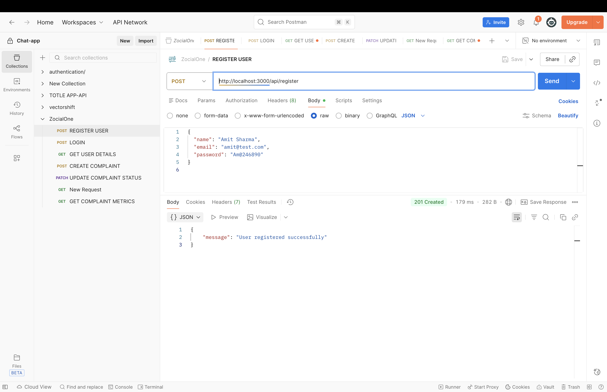
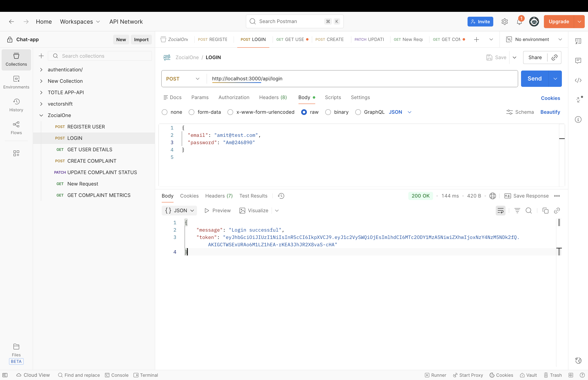
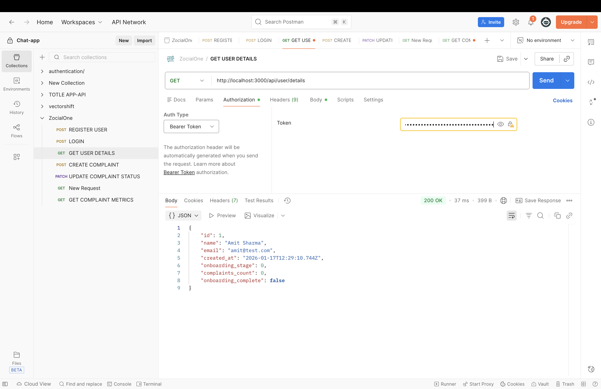
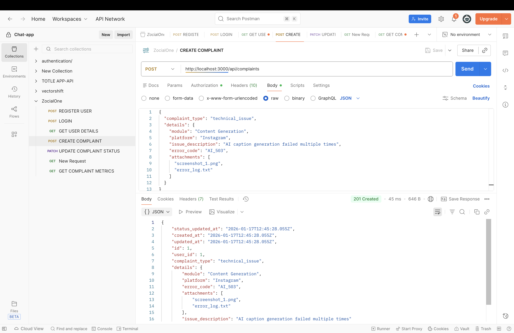
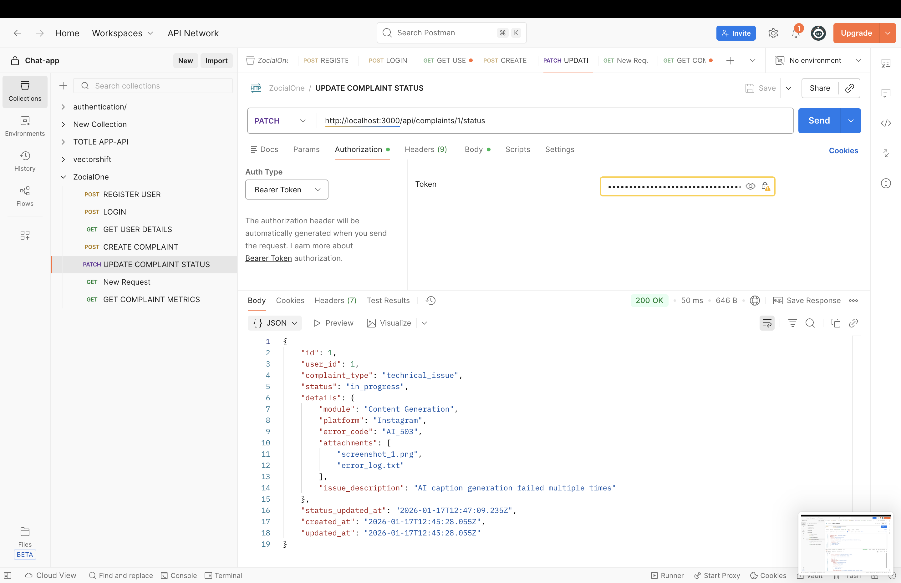
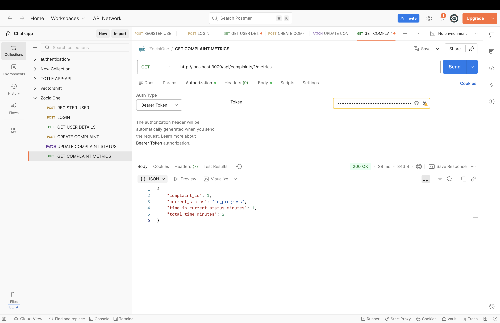

## Setup

### Install Dependencies
```bash
npm install
```

### Environment Variables
Create a `.env` file:

```env
PORT=3000

DB_NAME=your_database_name
DB_USER=your_database_user
DB_PASS=your_database_password
DB_HOST=localhost
DB_DIALECT=postgres

PASSWORD_SECRET=your_password_secret_key
JWT_SECRET=your_jwt_secret_key
```

### Database
Uses PostgreSQL with Sequelize. Tables are created automatically on server start.

### Run
```bash
npm start
```

Server runs at `http://localhost:3000`

## Project Structure

```
├── server.js                    # Main entry point
├── config/
│   └── sequelize.js            # Database connection setup
├── models/                     # Database models
│   ├── User.Model.js
│   ├── Complaint.model.js
│   └── Notification.model.js
├── Routes/                     # API routes
│   ├── auth.routes.js
│   ├── complaint.routes.js
│   └── user.routes.js
├── Controller/                 # Controllers for handling requests
│   ├── Auth.controller.js
│   ├── Complaint.controller.js
│   └── User.controller.js
├── Middlewares/               # Auth middleware
│   └── Auth.middleware.js
├── services/                  # Business logic
│   ├── User.service.js
│   ├── Complaint.service.js
│   ├── ComplaintMetrics.service.js
│   ├── Notification.service.js
│   ├── onboarding.service.js
│   └── onboardingNotification.service.js
├── utils/                     # Utility functions
│   ├── complaintStatusFlow.js
│   ├── complaintValidators.js
│   ├── onboardingSchedule.js
│   └── onboardingTemplates.js
└── cron/                      # Scheduled tasks
    └── onboardingReminder.cron.js
```

## Technologies

- Express
- Sequelize & PostgreSQL
- bcryptjs
- jsonwebtoken
- node-cron
- dotenv

## Features

- JWT authentication
- Complaint management
- Notifications
- Automated onboarding reminders
- Complaint analytics

## API Endpoints

### Authentication
- `POST /api/register` - Register user
- `POST /api/login` - Login user

### User
- `GET /api/user/details` - Get user details

### Complaints
- `POST /api/complaints` - Create complaint
- `PATCH /api/complaints/:id/status` - Update status
- `GET /api/complaints/:id/metrics` - Get metrics

## API Testing Screenshots

### Authentication
**POST /api/register**


**POST /api/login**


### User
**GET /api/user/details**


### Complaints
**POST /api/complaints**


**PATCH /api/complaints/:id/status**


**GET /api/complaints/:id/metrics**


---

**Note:** I took help from AI to understand the cron job implementation as I was a bit confused about how it works.